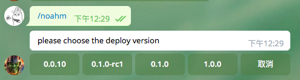
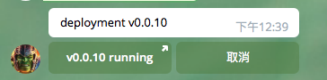

# telegram-gitlab-deploy-bot
A deployment bot for gitlab by telegram,

this bot will create a new tag to your gitlab repository

## I. register the telegram bot and get the token
start the `@BotFather`

## II. docker usage

1. modify your docker-compose.yml

```
version: '2'
services:
  noah-m-bot:
    image: echoulen/telegram-gitlab-deploy-bot:latest
    restart: always
    environment:
      - GITLAB_TOKEN=39ma21A6HR-azivDozJ1
      - GITLAB_URL=http://192.168.0.10
      - PROJECT_NO=76
      - BRANCH=master
      - BOT_TOKEN=540098765:AAH35xfJ9qiXFTulFGmKM2n0hAT8xneps50
      - BOT_COMMAND=noahm
```

2. start the docker container

```
docker-compose up -d noah-m-bot
```

3. send deploy command to your bot




